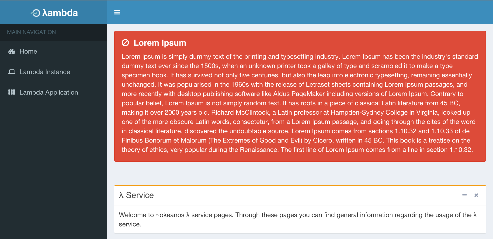

# Messages on the central service

## Description

This guide describes how to publish a message on the [Central service](https://lambda.grnet.gr) of the service. This guide is intended to be used only by the administrators of the central service VM. 

The administrator of the central service must first login the machine using ssh and become the `root` user. From the command line provide the following command 

```sh
$ cd /var/www/okeanos-LoD/central_service/app/frontend
```

to navigate to the appropriate folder. In order to publish (or remove) a message from the central service web interface the python script `admin-message.py` (located in the aforementioned folder) may be used. 

The following command prints out the help message related to this script:

```sh
$ python admin-message.py --help
usage: admin-message.py [-h] [--action {set,remove}] [--title TITLE]
                        [--message MESSAGE]
                        [--type {danger,warning,info,success}]

Admin Message

optional arguments:
  -h, --help            show this help message and exit
  --action {set,remove}
                        set or remove an admin message (default: set)
  --title TITLE         title of the admin message (used only with set action,
                        default:"Title")
  --message MESSAGE     admin message (used only with set action,
                        default="Message")
  --type {danger,warning,info,success}
                        the type of the message (used only with set action,
                        default="info")
```

In order to add a new message to the central web interface the `set` action should be used. The `--title` and `--message` arguments accept text as their arguments. Based on the the message itself (its contents) an appropriate `--type` should be used alongside (`info` for blue background, `success` for green, `warning` for orange and `danger` for red).

The following command will generate a "Lorem Ipsum" message on the central web interface
as it is shown also on the screenshot picture below. 

```sh
$ python admin-message.py --action set \
  --title "Lorem Ipsum" \
  --message "Lorem Ipsum is ..." \
  --type danger
```

Result:



To remove the message the `remove` action should be used (without any further arguments), like so:

```sh
$ python admin-message.py --action remove
```